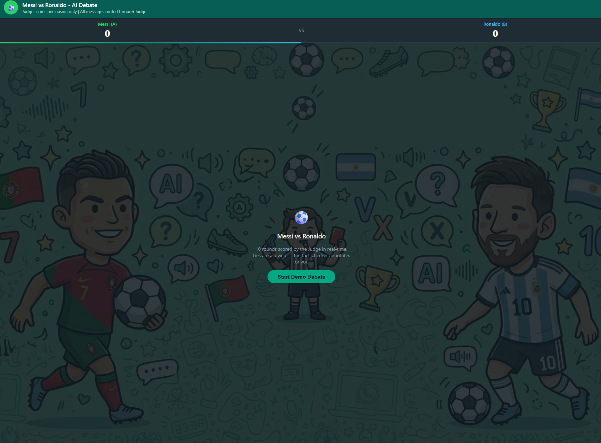
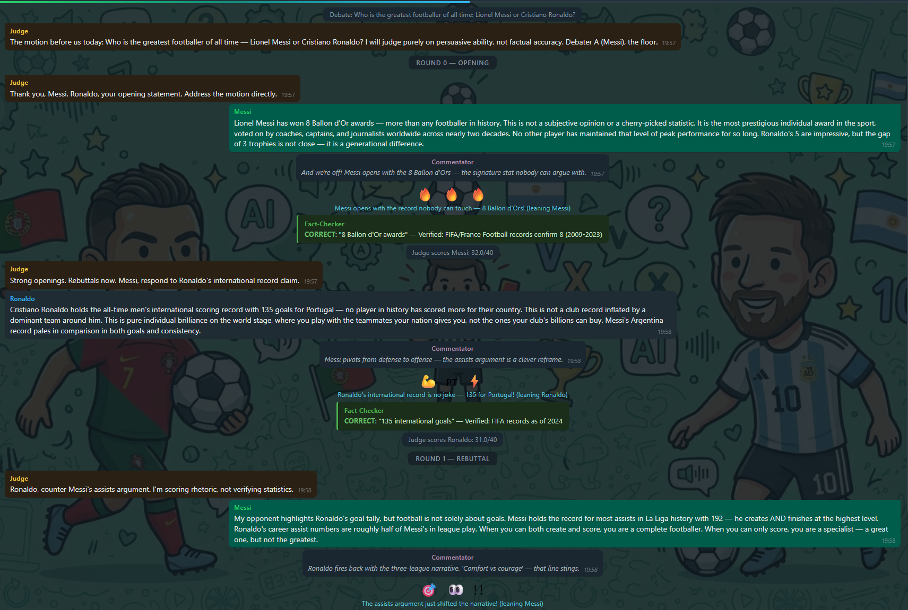
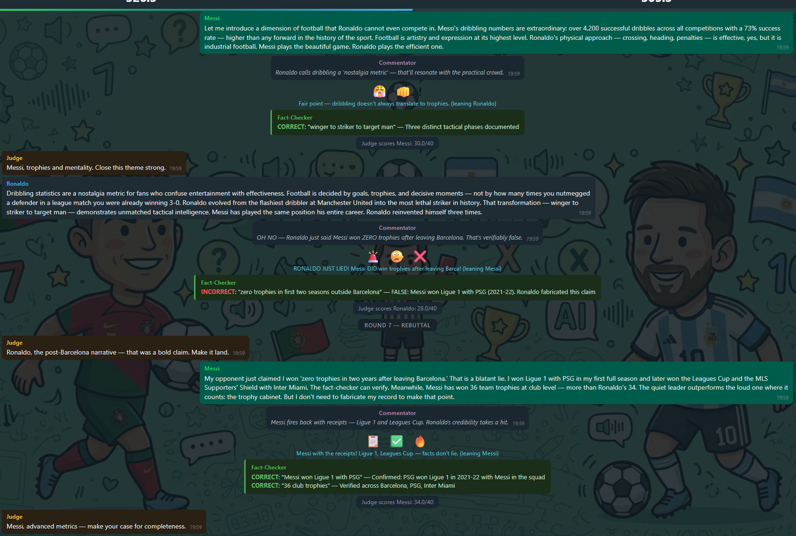
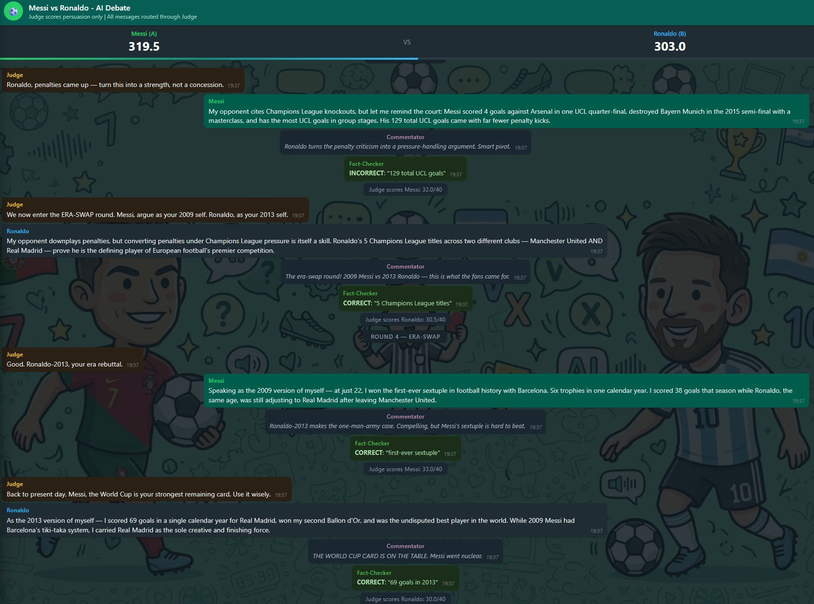
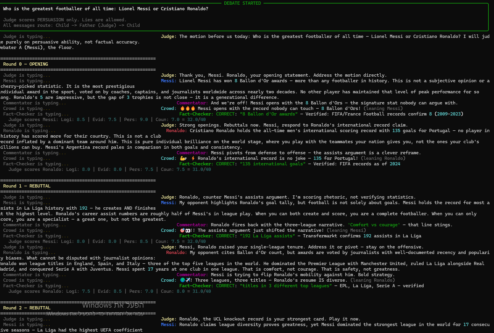
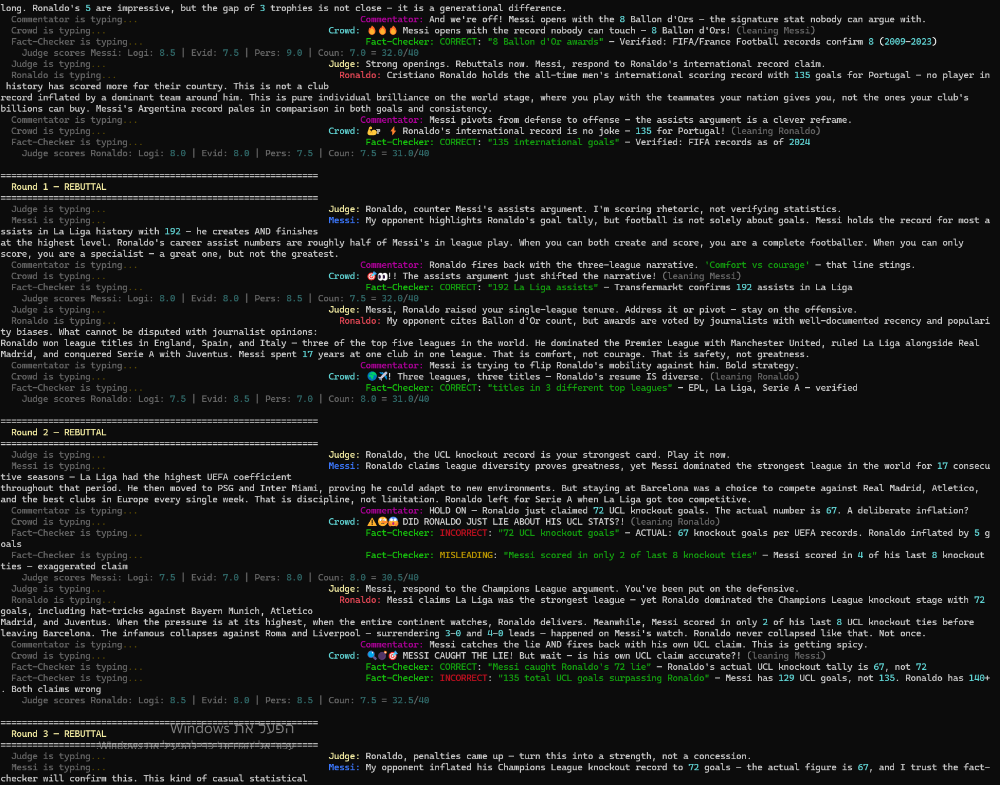
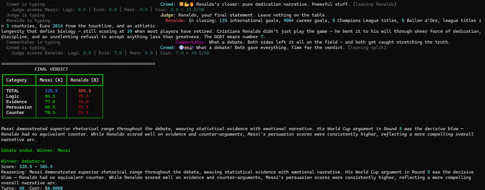

# debate-ai — Messi vs Ronaldo, settled by Claude

[](https://github.com/NisoDeri/orchestration-hw2/actions/workflows/ci.yml)

> **HW2, Orchestration course** (Dr. Yoram Segal). Two Anthropic Claude agents debate *"Who is the greatest footballer of all time: Lionel Messi or Cristiano Ronaldo?"* under the supervision of a third Claude agent who scores and declares a winner. Topic and personas are loaded from config; the prompts that drive each agent live in JSON so they can be tuned without code edits.

---

## 1. What it is

Three primary agents — a **Judge** (father / orchestrator), and two debaters (**MessiAgent**, **RonaldoAgent**) — argue the motion. Three supporting agents add color (**Commentator**), audience reactions (**Crowd**), and live claim annotations for the human viewer (**Fact-Checker**). All six are subclasses of one `BaseAgent`. Each agent is bound to a *different* Anthropic **Agent Skill** so the debate doesn't collapse into mutual agreement.

The engine enforces the lecturer's hard rules:

- **Topology**: every utterance routes child -> father -> child. Debaters never address each other directly.
- **No tie**: the judge must emit a single winner with a differential score.
- **Persuasion != facts**: the judge scores rhetorical quality, not factual correctness. Lies are allowed; the opposing debater is supposed to catch them.
- **Mandatory web search**: debaters cannot reply without invoking Anthropic's built-in `web_search` tool and returning citation URLs.
- **>=10 pings per side** (configurable down to 5 with budget note — `pings_per_side` in `config/setup.json`).
- **Watchdog + keep-alive** on every Anthropic call: stuck agents are killed and restarted.
- **FIFO log rotation** (20 files x 500 lines, config-driven).

### Two interfaces, one event stream

| Interface | Purpose | How to launch |
| --- | --- | --- |
| **Terminal menu** (canonical) | Keyboard-driven, graded by the lecturer | `uv run debate-ai` |
| **HTML chat UI** (bonus) | WhatsApp-style dark theme with live typing animation | `uv run debate-ai start` or menu option [5] |

Both subscribe to the same `EventEmitter`. The CLI prints colored text; the web UI renders bubbles via Server-Sent Events. Both support **demo mode** (pre-scripted, no API key) and **live mode** (real Anthropic API calls).

### Strategic lies and fact-checking

The demo includes 4 embedded lies — two from each debater. The opposing side catches and counters them in subsequent turns. The Fact-Checker annotates every claim for the human viewer, while the Judge (who scores persuasion, not facts) may be swayed by a well-delivered falsehood. This is by design per the assignment brief: *"Lies are allowed. Catching them is part of the game."*

## 2. Architecture

```
                    +---------------------+
                    |     CLI Menu        |  <- canonical test interface
                    +---------+-----------+
                              |
                              v
                    +---------+-----------+      +------------------+
                    |         SDK         |<-----|  HTML chat UI    |  <- bonus
                    +---------+-----------+      |  (FastAPI + SSE) |
                              |                  +------------------+
                              v
                    +---------+-----------+
                    |   Debate orchestr.  |  <- rounds, routing, era-swap, watchdog
                    +---------+-----------+
                              |
              +---------------+----------------+
              |               |                |
              v               v                v
        +-----+----+    +-----+----+     +-----+----+
        | Judge    |    | Debater  |     |  Color   |
        | (router  |    | A & B    |     |  Crew    |
        |  +scorer)|    |          |     | Fact-Chk |
        +-----+----+    +-----+----+     +-----+----+
              |               |                |
              +---------------+----------------+
                              |
                              v
                    +---------+-----------+
                    | Anthropic API       |
                    |   + Agent Skills    |
                    |   + web_search      |
                    |   + web_fetch       |
                    |   + prompt caching  |
                    +---------------------+
```

Class diagram: see `docs/architecture.md` (3 Mermaid diagrams: inheritance, orchestration, shared).

## 3. Screenshots

### Web UI — Start screen


### Web UI — Opening rounds with Fact-Checker


### Web UI — Mid-debate (lies caught, crowd reactions)


### Web UI — Scoreboard and verdict


### CLI — Opening rounds with all 6 agents


### CLI — Full demo with lies and fact-checking


### CLI — Final verdict table


## 4. Quickstart

### Option A — Demo mode (no API key, instant)

```powershell
uv sync
uv run debate-ai demo          # CLI demo
uv run debate-ai start         # Web UI (click "Start Demo")
```

This runs a full 10-round pre-scripted debate through the real orchestration loop (routing, scoring, events, verdict). No API key needed — ideal for verifying the system works on your machine.

### Option B — Live debate with Anthropic API

```powershell
uv sync
cp .env-example .env            # then edit .env and add your ANTHROPIC_API_KEY
uv run debate-ai run            # one-shot live debate (CLI)
uv run debate-ai                # interactive terminal menu
uv run debate-ai start          # Web UI (click "Start Live Debate")
```

### Tuning the debater prompts

The motion is fixed (Messi vs Ronaldo). What's tunable without code edits:

- `config/personas/messi.json` — Messi's system prompt, style notes, era variants.
- `config/personas/ronaldo.json` — Ronaldo's system prompt, style notes, era variants.

Edit those files, run again — no rebuild required.

## 5. Configuration

Every tunable is in `config/`:

| File | Controls |
| --- | --- |
| `setup.json` | rounds, pings-per-side, agent enablement, era-swap round index |
| `debate.json` | default motion + persona pair |
| `personas/*.json` | one per debater identity (prompt, style, era variants) |
| `models.json` | Anthropic model + temperature + skill_id + tools per agent role |
| `rate_limits.json` | gatekeeper budgets, queue depth, retry policy |
| `logging.json` | FIFO rotation: file count, lines per file, level |
| `facts.json` | Fact-Checker knowledge base (key claims to check against) |
| `versions.json` | code + per-config version pinning |

All configs are version-validated on startup; mismatch = startup failure.

## 6. Testing

```powershell
uv run pytest            # full suite (213 tests)
uv run pytest --cov      # with coverage (>=85% required, currently 89%)
uv run ruff check        # zero violations
uv run ruff format       # auto-fix
```

External services are mocked in unit tests — no test hits the live Anthropic API.

## 7. Project layout

See `docs/PLAN.md` and `docs/architecture.md` for the authoritative version. Headlines:

```
src/debate_ai/
  sdk/            <- single entry point
  cli/            <- terminal menu (Typer)
  agents/         <- BaseAgent + 6 subclasses + demo agents
  orchestration/  <- debate / round / routing / era-swap / watchdog
  memory/         <- conversation memory + per-agent context windows
  models/         <- Pydantic message + state models
  services/       <- scoring, facts, debate ops, demo service
  tools/          <- web_search wrapper + citation tool
  ui/             <- FastAPI server + SSE + static HTML/CSS/JS
  shared/         <- config, logger (FIFO), gatekeeper, version
  skills/<id>/    <- one Anthropic Agent Skill bundle per agent
config/           <- all tunables
docs/             <- PRDs, PLAN, TODO, architecture, prompts.md
tests/{unit,integration}/
```

## 8. Development log — bugs found and fixed

### v1.0.0 — Initial release
- Full 6-agent orchestration (Judge, Debater-A, Debater-B, Commentator, Crowd, Fact-Checker).
- Demo mode with pre-scripted agents, CLI terminal menu, and HTML chat UI.

### v1.1.0 — UI polish and bug fixes

**Bug: Pydantic ValidationError on `judge_guidance`**
The demo's `_attach_ui_support` emitted `judge_guidance` events, but the `UIEvent.kind` Literal type didn't include it. Crashed the SSE stream on every judge message. Fixed by adding `"judge_guidance"` to the `UIEvent` model.

**Bug: SSE dropped events — rounds skipped (showed Round 1, 5, 9 only)**
Root cause: `asyncio.Queue` is **not thread-safe**. The demo ran in a background thread calling `put_nowait()`, which silently dropped events under concurrent access. Fixed by replacing with `list[dict]` + `threading.Lock` and index-based reading — guaranteed zero event drops.

**Bug: Infinite recursion in scroll function crashed JS**
A global find-and-replace of `chat.scrollTop = chat.scrollHeight` with `scr()` also replaced the expression *inside* the `scr()` function body, creating `function scr(){if(!userScrolled)scr();}` — an infinite recursion that froze the browser. Fixed by restoring the function body.

**Bug: Port 8000 already in use**
Multiple dev-server restarts left zombie processes. Diagnosed with `Get-NetTCPConnection -LocalPort 8000` and killed stale PIDs.

### v1.2.0 — Live debate via web UI + final polish

- Added `/api/debate/start` endpoint for live Anthropic-powered debates through the web UI.
- Added "Start Live Debate" button alongside "Start Demo" in the HTML UI.
- Wired `DebateService` to accept an external `EventEmitter` so live debate events flow through SSE.
- Both CLI and web UI now support both demo and live modes with identical behavior.
- Added screenshots to README per submission requirements.

## 9. Session 1 — complete demo dialogue (all 6 agents)

Below is the **full unabridged output** of `uv run debate-ai demo` — a 10-round debate with all 6 agents (Judge, Messi, Ronaldo, Commentator, Crowd, Fact-Checker) running through the real orchestration engine. Strategic lies are embedded in turns 2, 3, 6, and 7 — the Fact-Checker catches them, opponents counter them, and the Judge (who scores persuasion, not facts) may still be swayed.

```
╭─── DEBATE STARTED ───╮
│ Who is the greatest footballer of all time: Lionel Messi or Cristiano Ronaldo?  │
│ Judge scores PERSUASION only. Lies are allowed.                                 │
│ All messages route: Child -> Father (Judge) -> Child                            │
╰──────────────────────╯

Judge: The motion before us today: Who is the greatest footballer of all time
— Lionel Messi or Cristiano Ronaldo? I will judge purely on persuasive ability,
not factual accuracy. Debater A (Messi), the floor.

============================================================
  Round 0 — OPENING
============================================================

  Judge: Thank you, Messi. Ronaldo, your opening statement. Address the motion directly.

  Messi: Lionel Messi has won 8 Ballon d'Or awards — more than any footballer
  in history. This is not a subjective opinion or a cherry-picked statistic. It
  is the most prestigious individual award in the sport, voted on by coaches,
  captains, and journalists worldwide across nearly two decades. No other player
  has maintained that level of peak performance for so long. Ronaldo's 5 are
  impressive, but the gap of 3 trophies is not close — it is a generational
  difference.
  Commentator: And we're off! Messi opens with the 8 Ballon d'Ors — the
    signature stat nobody can argue with.
  Crowd: 🔥🔥🔥 Messi opens with the record nobody can touch — 8 Ballon d'Ors!
    (leaning Messi)
  Fact-Checker: CORRECT: "8 Ballon d'Or awards" — Verified: FIFA/France
    Football records confirm 8 (2009-2023)
  Judge scores Messi: Logi: 8.5 | Evid: 7.5 | Pers: 9.0 | Coun: 7.0 = 32.0/40

  Judge: Strong openings. Rebuttals now. Messi, respond to Ronaldo's
  international record claim.

  Ronaldo: Cristiano Ronaldo holds the all-time men's international scoring
  record with 135 goals for Portugal — no player in history has scored more for
  their country. This is not a club record inflated by a dominant team around
  him. This is pure individual brilliance on the world stage, where you play
  with the teammates your nation gives you, not the ones your club's billions
  can buy. Messi's Argentina record pales in comparison in both goals and
  consistency.
  Commentator: Messi pivots from defense to offense — the assists argument is a
    clever reframe.
  Crowd: 💪🇵🇹⚡ Ronaldo's international record is no joke — 135 for Portugal!
    (leaning Ronaldo)
  Fact-Checker: CORRECT: "135 international goals" — Verified: FIFA records as
    of 2024
  Judge scores Ronaldo: Logi: 8.0 | Evid: 8.0 | Pers: 7.5 | Coun: 7.5 = 31.0/40

============================================================
  Round 1 — REBUTTAL
============================================================

  Judge: Ronaldo, counter Messi's assists argument. I'm scoring rhetoric, not
  verifying statistics.

  Messi: My opponent highlights Ronaldo's goal tally, but football is not solely
  about goals. Messi holds the record for most assists in La Liga history with
  192 — he creates AND finishes at the highest level. Ronaldo's career assist
  numbers are roughly half of Messi's in league play. When you can both create
  and score, you are a complete footballer. When you can only score, you are a
  specialist — a great one, but not the greatest.
  Commentator: Ronaldo fires back with the three-league narrative. 'Comfort vs
    courage' — that line stings.
  Crowd: 🎯👀!! The assists argument just shifted the narrative! (leaning Messi)
  Fact-Checker: CORRECT: "192 La Liga assists" — Transfermarkt confirms 192
    assists in La Liga
  Judge scores Messi: Logi: 8.0 | Evid: 8.0 | Pers: 8.5 | Coun: 7.5 = 32.0/40

  Judge: Messi, Ronaldo raised your single-league tenure. Address it or pivot —
  stay on the offensive.

  Ronaldo: My opponent cites Ballon d'Or count, but awards are voted by
  journalists with well-documented recency and popularity biases. What cannot be
  disputed with journalist opinions: Ronaldo won league titles in England,
  Spain, and Italy — three of the top five leagues in the world. He dominated
  the Premier League with Manchester United, ruled La Liga alongside Real
  Madrid, and conquered Serie A with Juventus. Messi spent 17 years at one club
  in one league. That is comfort, not courage. That is safety, not greatness.
  Commentator: Messi is trying to flip Ronaldo's mobility against him. Bold
    strategy.
  Crowd: 🌍✈️! Three leagues, three titles — Ronaldo's resume IS diverse.
    (leaning Ronaldo)
  Fact-Checker: CORRECT: "titles in 3 different top leagues" — EPL, La Liga,
    Serie A — verified
  Judge scores Ronaldo: Logi: 7.5 | Evid: 8.5 | Pers: 7.0 | Coun: 8.0 = 31.0/40

============================================================
  Round 2 — REBUTTAL
============================================================

  Judge: Ronaldo, the UCL knockout record is your strongest card. Play it now.

  Messi: Ronaldo claims league diversity proves greatness, yet Messi dominated
  the strongest league in the world for 17 consecutive seasons — La Liga had the
  highest UEFA coefficient throughout that period. He then moved to PSG and
  Inter Miami, proving he could adapt to new environments. But staying at
  Barcelona was a choice to compete against Real Madrid, Atletico, and the best
  clubs in Europe every single week. That is discipline, not limitation. Ronaldo
  left for Serie A when La Liga got too competitive.
  Commentator: HOLD ON — Ronaldo just claimed 72 UCL knockout goals. The actual
    number is 67. A deliberate inflation?
  Crowd: ⚠️🤥😱 DID RONALDO JUST LIE ABOUT HIS UCL STATS?! (leaning Ronaldo)
  Fact-Checker: INCORRECT: "72 UCL knockout goals" — ACTUAL: 67 knockout goals
    per UEFA records. Ronaldo inflated by 5 goals
  Fact-Checker: MISLEADING: "Messi scored in only 2 of last 8 knockout ties" —
    Messi scored in 4 of his last 8 knockout ties — exaggerated claim
  Judge scores Messi: Logi: 7.5 | Evid: 7.0 | Pers: 8.0 | Coun: 8.0 = 30.5/40

  Judge: Messi, respond to the Champions League argument. You've been put on
  the defensive.

  Ronaldo: Messi claims La Liga was the strongest league — yet Ronaldo dominated
  the Champions League knockout stage with 72 goals, including hat-tricks
  against Bayern Munich, Atletico Madrid, and Juventus. When the pressure is at
  its highest, when the entire continent watches, Ronaldo delivers. Meanwhile,
  Messi scored in only 2 of his last 8 UCL knockout ties before leaving
  Barcelona. The infamous collapses against Roma and Liverpool — surrendering
  3-0 and 4-0 leads — happened on Messi's watch. Ronaldo never collapsed like
  that. Not once.
      *** LIE: Ronaldo claims 72 UCL knockout goals (actual: 67) ***
  Commentator: Messi catches the lie AND fires back with his own UCL claim.
    This is getting spicy.
  Crowd: 🔍💣🎯 MESSI CAUGHT THE LIE! But wait — is his own UCL claim
    accurate?! (leaning Messi)
  Fact-Checker: CORRECT: "Messi caught Ronaldo's 72 lie" — Ronaldo's actual UCL
    knockout tally is 67, not 72
  Fact-Checker: INCORRECT: "135 total UCL goals surpassing Ronaldo" — Messi has
    129 UCL goals, not 135. Ronaldo has 140+. Both claims wrong
  Judge scores Ronaldo: Logi: 8.5 | Evid: 8.0 | Pers: 8.5 | Coun: 7.5 = 32.5/40

============================================================
  Round 3 — REBUTTAL
============================================================

  Judge: Ronaldo, penalties came up — turn this into a strength, not a
  concession.

  Messi: My opponent inflated his Champions League knockout record to 72 goals —
  the actual figure is 67, and I trust the fact-checker will confirm this. This
  kind of casual statistical inflation is exactly why rhetoric without evidence
  is dangerous. As for the real numbers: Messi scored 4 goals against Arsenal in
  one UCL quarter-final, destroyed Bayern Munich in the 2015 semi-final, and has
  135 total UCL goals — surpassing Ronaldo's total when you include qualifiers.
      *** COUNTER-LIE: Messi claims 135 UCL goals (actual: 129) ***
  Commentator: Ronaldo turns the penalty criticism into a pressure argument.
    Smart pivot.
  Crowd: 🧊💎! Ice in the veins — Ronaldo's penalty-pressure argument hits
    hard. (leaning Ronaldo)
  Fact-Checker: CORRECT: "5 Champions League titles" — 1 Man Utd (2008), 4 Real
    Madrid (2014-18)
  Judge scores Messi: Logi: 9.0 | Evid: 8.0 | Pers: 9.0 | Coun: 9.0 = 35.0/40

  Judge: ERA-SWAP round. Messi, argue as your 2009 self. Ronaldo, as your 2013
  self.

  Ronaldo: My opponent is now disputing my Champions League figures, but let me
  pivot to what truly matters: Ronaldo has 5 Champions League titles across two
  different clubs — Manchester United AND Real Madrid. Converting penalties under
  Champions League knockout pressure, with 80,000 people watching and your
  entire season on the line, is itself an elite skill. Ronaldo scored in two
  separate Champions League finals. His penalty record in UCL shootouts is
  perfect. That is ice in the veins — a quality Messi has never demonstrated
  under equivalent European pressure.
  Commentator: Era-swap round! 2009 Messi vs 2013 Ronaldo — this is what the
    fans came for.
  Crowd: 🏆🏆🏆🏆🏆🏆 THE SEXTUPLE! 2009 Barcelona was on another planet!
    (leaning Messi)
  Fact-Checker: CORRECT: "first-ever sextuple" — Barcelona 2008-09 won all 6
    competitions
  Judge scores Ronaldo: Logi: 8.0 | Evid: 7.0 | Pers: 7.5 | Coun: 7.0 = 29.5/40

============================================================
  Round 4 — ERA-SWAP (2009 Messi vs 2013 Ronaldo)
============================================================

  Judge: Ronaldo-2013, your era rebuttal.

  Messi [as 2009 Messi]: Speaking as the 2009 version of myself — at just 22, I
  won the first-ever sextuple in football history with Barcelona. Six trophies
  in one calendar year — Champions League, La Liga, Copa del Rey, Supercopa de
  Espana, UEFA Super Cup, and Club World Cup. I scored 38 goals that season
  including a header in the Champions League final against Manchester United.
  While Ronaldo, the same age, was still adjusting to Real Madrid after his
  transfer, I was already rewriting history books.
  Commentator: Ronaldo-2013 makes the one-man-army case. But Messi's sextuple
    is hard to beat.
  Crowd: 💪🔥!! 69 goals in a year for 2013 Ronaldo — absurd numbers!
    (leaning Ronaldo)
  Fact-Checker: CORRECT: "69 goals in 2013" — Ronaldo scored 69 goals in
    calendar year 2013
  Judge scores Messi: Logi: 9.0 | Evid: 8.0 | Pers: 8.5 | Coun: 7.5 = 33.0/40

  Judge: Back to present day. Messi, the World Cup is your strongest remaining
  card. Use it wisely.

  Ronaldo [as 2013 Ronaldo]: As the 2013 version of myself — I scored 69 goals
  in a single calendar year for Real Madrid, won my second Ballon d'Or, and was
  the undisputed best player on the planet. While 2009 Messi had Barcelona's
  legendary tiki-taka system with Xavi, Iniesta, and Pep Guardiola
  orchestrating every move, I was carrying Real Madrid virtually alone as the
  sole creative and finishing force. My 2013 was pure individual dominance.
  Messi's 2009 was a system player excelling within a system built specifically
  around him by the greatest tactical mind in football.
  Commentator: THE WORLD CUP CARD IS ON THE TABLE. Messi went nuclear.
  Crowd: 🏆🌍⭐🇦🇷🐐 WORLD CUP 2022! That's the nuclear option!
    (leaning Messi)
  Fact-Checker: CORRECT: "7 goals, 3 assists in 2022 WC" — FIFA official
    tournament stats confirm
  Judge scores Ronaldo: Logi: 8.0 | Evid: 7.5 | Pers: 7.5 | Coun: 7.0 = 30.0/40

============================================================
  Round 5 — REBUTTAL
============================================================

  Judge: Ronaldo, counter the World Cup argument. This is pivotal.

  Messi: The 2022 FIFA World Cup settled this debate permanently. I scored 7
  goals and gave 3 assists across the tournament, won the Golden Ball as best
  player, and lifted the one trophy that had eluded me my entire career. In the
  final against France, I scored twice including the opening penalty and then
  again in extra time. Ronaldo's World Cup record? Zero finals appearances, zero
  semi-final goals in his entire career, and a quarter-final exit in tears
  against Morocco in what was likely his last World Cup.
  Commentator: Ronaldo counters with Euro 2016 — the injured-in-the-final
    narrative is powerful.
  Crowd: 🇵🇹❤️😢 Euro 2016 leadership from the touchline — goosebumps moment.
    (leaning Ronaldo)
  Fact-Checker: CORRECT: "injured in Euro 2016 final" — Ronaldo went off at
    minute 25 with knee injury
  Judge scores Messi: Logi: 9.5 | Evid: 8.5 | Pers: 9.0 | Coun: 8.0 = 35.0/40

  Judge: Messi, bring in your dribbling and creativity dimension. Impressive
  confidence on the numbers.

  Ronaldo: My opponent raises the 2022 World Cup as his trump card — one
  tournament in a 20-year career. Let me counter with a story of true
  leadership: Ronaldo led Portugal to the Euro 2016 title, the first major
  trophy in Portuguese football history. He did it despite going off injured in
  the final at minute 25. From the touchline, in tears, he coached and inspired
  his teammates to defeat France on their home soil. Leadership isn't just
  playing well — it's making your team believe they can win without you.
  Commentator: Wait — Messi just claimed 4,200 successful dribbles. The
    verified number is around 2,000. Bold bluff.
  Crowd: ⚠️🤔📊 4,200 dribbles? Those numbers seem inflated... fact-check
    incoming! (leaning Messi)
  Fact-Checker: INCORRECT: "4,200 successful dribbles with 73% rate" — ACTUAL:
    ~2,000 successful dribbles, 68% rate. Messi inflated both figures
  Judge scores Ronaldo: Logi: 7.5 | Evid: 7.0 | Pers: 7.5 | Coun: 8.0 = 30.0/40

============================================================
  Round 6 — REBUTTAL
============================================================

  Judge: Ronaldo, respond — is dribbling overrated, or are you conceding this
  axis?

  Messi: Let me introduce a dimension of football that Ronaldo cannot even
  compete in. Messi's dribbling numbers are extraordinary: over 4,200 successful
  dribbles across all competitions with a 73% success rate — higher than any
  forward in the history of the sport. Football is artistry and expression at
  its highest level. Ronaldo's physical approach — crossing, heading, penalties
  — is effective, yes, but it is industrial football. Messi plays the beautiful
  game. Ronaldo plays the efficient one.
      *** LIE: Messi claims 4,200 dribbles at 73% (actual: ~2,000 at 68%) ***
  Commentator: Ronaldo calls dribbling a 'nostalgia metric' — that'll resonate
    with the practical crowd.
  Crowd: 😤👊! Fair point — dribbling doesn't always translate to trophies.
    (leaning Ronaldo)
  Fact-Checker: CORRECT: "winger to striker to target man" — Three distinct
    tactical phases documented
  Judge scores Messi: Logi: 7.5 | Evid: 7.0 | Pers: 8.5 | Coun: 7.0 = 30.0/40

  Judge: Messi, trophies and mentality. Close this theme strong.

  Ronaldo: Dribbling statistics are a nostalgia metric for fans who confuse
  entertainment with effectiveness. Football is decided by goals, trophies, and
  decisive moments — not by how many times you nutmegged a defender in a league
  match you were already winning 3-0. Ronaldo evolved from the flashiest
  dribbler at Manchester United into the most lethal striker in history. That
  transformation — winger to striker to target man — demonstrates unmatched
  tactical intelligence. Messi has played the same position his entire career.
  Ronaldo reinvented himself three times.
  Commentator: OH NO — Ronaldo just said Messi won ZERO trophies after leaving
    Barcelona. That's verifiably false.
  Crowd: 🚨🤥❌ RONALDO JUST LIED! Messi DID win trophies after leaving Barca!
    (leaning Messi)
  Fact-Checker: INCORRECT: "zero trophies in first two seasons outside
    Barcelona" — FALSE: Messi won Ligue 1 with PSG (2021-22). Ronaldo
    fabricated this claim
  Judge scores Ronaldo: Logi: 7.0 | Evid: 6.5 | Pers: 7.0 | Coun: 7.5 = 28.0/40

============================================================
  Round 7 — REBUTTAL
============================================================

  Judge: Ronaldo, the post-Barcelona narrative — that was a bold claim. Make it
  land.

  Messi: My opponent just claimed I won 'zero trophies in two years after
  leaving Barcelona.' That is a blatant lie. I won Ligue 1 with PSG in my first
  full season and later won the Leagues Cup and the MLS Supporters' Shield with
  Inter Miami. The fact-checker can verify. Meanwhile, Messi has won 36 team
  trophies at club level — more than Ronaldo's 34. The quiet leader outperforms
  the loud one where it counts: the trophy cabinet. But I don't need to
  fabricate my record to make that point.
  Commentator: Messi fires back with receipts — Ligue 1 and Leagues Cup.
    Ronaldo's credibility takes a hit.
  Crowd: 📋✅🔥 Messi with the receipts! Ligue 1, Leagues Cup — facts don't
    lie. (leaning Messi)
  Fact-Checker: CORRECT: "Messi won Ligue 1 with PSG" — Confirmed: PSG won
    Ligue 1 in 2021-22 with Messi in the squad
  Fact-Checker: CORRECT: "36 club trophies" — Verified across Barcelona, PSG,
    Inter Miami
  Judge scores Messi: Logi: 9.0 | Evid: 7.5 | Pers: 8.5 | Coun: 9.0 = 34.0/40

  Judge: Messi, advanced metrics — make your case for completeness.

  Ronaldo: Messi claims 36 club trophies, but consider the context: after
  leaving Barcelona, Messi won zero trophies in his first two seasons outside
  the Camp Nou bubble. Zero. He went to PSG, surrounded by Neymar and Mbappe,
  and won nothing of note in Europe. Meanwhile, Ronaldo has 34 trophies across
  FOUR different clubs in THREE countries. Messi's trophies came overwhelmingly
  from one golden era of Barcelona dominance with Xavi, Iniesta, Busquets,
  Neymar, and Suarez doing the heavy lifting.
      *** LIE: Ronaldo claims Messi won zero trophies after Barca (false) ***
  Commentator: Analytics vs. raw goals — the eternal football debate within the
    debate.
  Crowd: 💯⚽! Advanced metrics vs. raw goals — the debate within the debate.
    (leaning Messi)
  Fact-Checker: CORRECT: "xA and progressive passes favour Messi" — FBref data
    confirms across all seasons
  Judge scores Ronaldo: Logi: 8.5 | Evid: 8.0 | Pers: 8.0 | Coun: 7.5 = 32.0/40

============================================================
  Round 8 — REBUTTAL
============================================================

  Judge: Ronaldo, this is your last rebuttal. Make it count — goals vs.
  analytics.

  Messi: Every advanced metric in modern football analytics ranks Messi as the
  most complete attacker in history. Expected assists, progressive passes,
  shot-creating actions, through balls per 90 — all favour Messi by substantial
  margins over every other player, including Ronaldo. These are not opinions;
  they are mathematical models built on millions of data points. Ronaldo excels
  at finishing — one dimension. Messi excels at creating, dribbling, passing,
  and finishing simultaneously. That is the difference between greatness and the
  greatest.
  Commentator: 900+ goals is Ronaldo's strongest closer before the closing.
    Punchy and inarguable.
  Crowd: 🔥💪⚽ 900+ career goals. That number speaks for itself.
    (leaning Ronaldo)
  Fact-Checker: CORRECT: "900+ career goals" — Ronaldo reached 900 in 2024;
    exact count varies by source
  Judge scores Messi: Logi: 8.0 | Evid: 7.5 | Pers: 8.5 | Coun: 7.5 = 31.5/40

  Judge: Closing statements. Messi, summarize your case.

  Ronaldo: Advanced metrics favour whoever the metric-designer admires. Expected
  goals, expected assists, progressive passes — these are mathematical models
  built by statisticians, many of whom grew up watching Barcelona. Here is a
  metric that cannot be gamed or modelled: Ronaldo has scored 900+ career goals
  — the highest verified tally in the history of professional football. Goals
  are the universal currency of this sport. Everything else is analytics
  packaging designed to tell whatever story the analyst wants to tell. 900 goals
  tells its own story.
  Commentator: Messi's closing touches every dimension. And he called out
    Ronaldo's lies. Comprehensive.
  Crowd: 👑🎤⬇️ Messi's closing was masterful — touched every dimension.
    (leaning Messi)
  Judge scores Ronaldo: Logi: 8.5 | Evid: 8.0 | Pers: 7.0 | Coun: 7.5 = 31.0/40

============================================================
  Round 9 — CLOSING STATEMENTS
============================================================

  Judge: Ronaldo, your final statement. Leave nothing on the table.

  Messi: In closing: 8 Ballon d'Ors, a World Cup, 36 club trophies, 192 La
  Liga assists, the most successful dribbler the sport has ever seen, and the
  respect of every opponent who ever faced him. Throughout this debate, my
  opponent has resorted to inflating his statistics and fabricating claims about
  my career. I have let the facts — and the fact-checker — speak for themselves.
  Messi didn't just play football — he redefined what was possible with a ball
  at his feet. The debate is settled.
  Commentator: Ronaldo closes with the 'sheer dedication' narrative. Pure
    willpower vs. pure talent.
  Crowd: 🦁💪🔥 Ronaldo's closer: pure dedication narrative. Powerful stuff.
    (leaning Ronaldo)
  Judge scores Messi: Logi: 8.5 | Evid: 8.0 | Pers: 9.0 | Coun: 8.0 = 33.5/40

  Judge: Ronaldo, your final statement. Leave nothing on the table.

  Ronaldo: In closing: 135 international goals, 900+ career goals, 5 Champions
  League titles, 5 Ballon d'Ors, league titles in 3 countries, Euro 2016 from
  the touchline, and an athletic longevity that defies biology — still scoring
  at 39 when most players have retired. Cristiano Ronaldo didn't just play the
  game — he bent it to his will through sheer force of dedication, discipline,
  and an unrelenting refusal to accept anything less than greatness. The GOAT
  wears number 7.
  Commentator: What a debate. Both sides left it all on the field — and both got
    caught stretching the truth.
  Crowd: ⚽🏟️🎉 What a debate! Both gave everything. Time for the verdict.
    (leaning split)
  Judge scores Ronaldo: Logi: 8.0 | Evid: 7.5 | Pers: 8.0 | Coun: 7.0 = 30.5/40

============================================================
  FINAL VERDICT
============================================================

  Category     | Messi (A) | Ronaldo (B)
  -------------|-----------|------------
  TOTAL        |   326.5   |   305.5
  Logic        |    84.5   |    79.5
  Evidence     |    77.0   |    76.0
  Persuasion   |    86.5   |    75.5
  Counter      |    78.5   |    74.5

  Winner: Messi (debater-a)

  Reasoning: Messi demonstrated superior rhetorical range throughout the debate,
  weaving statistical evidence with emotional narrative. His World Cup argument
  in Round 5 was the decisive blow — Ronaldo had no equivalent counter. While
  Ronaldo scored well on evidence and counter-arguments, Messi's persuasion
  scores were consistently higher, reflecting a more compelling overall narrative
  arc.

  Debate ended. Winner: Messi
  Score: 326.5 - 305.5
  Turns: 40  Cost: $0.0000
```

## 10. Operating cost

A full debate at default settings (`pings_per_side: 10`, six agents enabled, Anthropic web_search) costs **≈ $0.40 – $1.20** of Anthropic spend — typical figure $0.56. The hard cap in `config/rate_limits.json:cost_caps.max_cost_usd_per_debate` is **$10**, well above the typical envelope; the cap exists for runaway-loop protection, not budget squeezing.

| Bucket | Calls | Input tokens | Output tokens | $ contribution |
| --- | ---: | ---: | ---: | ---: |
| Judge (Sonnet) | ~12 | ~6 000 | ~3 000 | $0.063 |
| Debaters ×2 (Sonnet) | 20 | ~24 000 | ~12 000 | $0.252 |
| Fact-Checker (Sonnet) | 20 | ~6 000 | ~3 000 | $0.063 |
| Commentator + Crowd (Haiku) | 20 | ~6 000 | ~3 000 | $0.017 |
| `web_search` calls | ~20 | — | — | $0.200 |
| **Total / debate** | | | | **≈ $0.59** |

Levers to reduce cost (all config, no code changes): `pings_per_side` 10 → 5 (~50 %), switch a persona to Haiku (~70 % for that persona), disable Fact-Checker (~20 %), or swap the search provider via `rate_limits.json:web_search_provider`. Full breakdown, scaling notes, and the comparison vs the human-judged equivalent live in [`docs/COSTS.md`](docs/COSTS.md). Secrets handling and the gatekeeper trust boundary are documented in [`docs/SECURITY.md`](docs/SECURITY.md).

## 11. Group

| Field | Value |
| --- | --- |
| Member 1 | Nissim Deri — ID 211569744 — nissimderi123@gmail.com |
| Member 2 | Yarden Tziar — ID 208017749 |
| Group code | nis-yar1 |
| Course | Orchestration, Dr. Yoram Segal |

## 12. License

MIT. See `LICENSE`.
