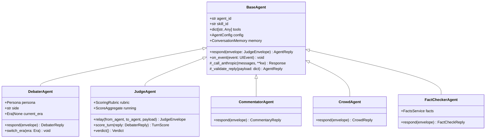
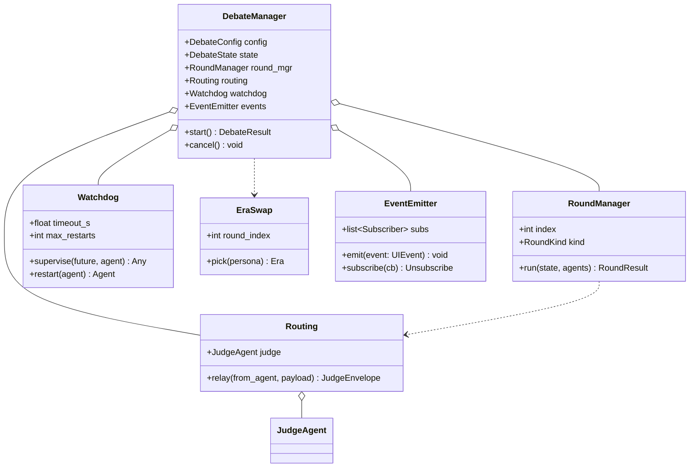
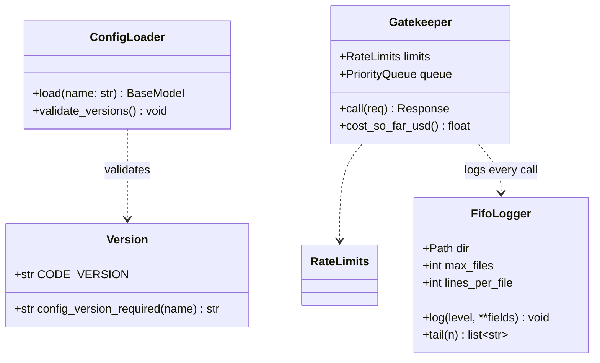

# Architecture — class diagram and module relationships

**Version**: 1.00 · Mandatory per HW2 brief §8.6 (OOP class diagram requirement).

## 1. Inheritance graph (Mermaid)

## 2. Orchestration relationships

## 3. Cross-cutting (shared)

## 4. Module dependency rules

- **CLI** depends only on **SDK**.
- **UI** (FastAPI server) depends only on **SDK** + **EventEmitter**.
- **SDK** depends on **Orchestration** + **Services** + **Memory** + **Models**.
- **Orchestration** depends on **Agents** + **Models** + **Memory** + **shared/**.
- **Agents** depend on **Tools** + **Memory** + **Models** + **shared/Gatekeeper**.
- **Tools** depend on **Anthropic SDK** + **shared/Gatekeeper**.
- **shared/** depends on nothing project-local except `models/` for typed config schemas.

**Forbidden edges** (will fail CI grep):
- `agents → orchestration` (would create a cycle).
- `cli → agents` (CLI must go through SDK).
- `ui → agents` (same).
- Anything → `cli` (CLI is a sink).

## 5. Where each spec mandate lives

| Brief item | Code location |
| --- | --- |
| Child → father → child (§8.3.7) | `orchestration/routing.py` + `agents/judge_agent.py::relay` |
| JSON message format (§8.3.8) | `models/message_models.py` |
| ≥10 pings (§8.3.3) | `orchestration/debate_manager.py` loop + `config/setup.json` |
| Mutual reference (§8.3.4) | `agents/debater_agent.py` system prompt + judge re-anchor check |
| Mandatory web search (§8.3.5) | `tools/web_search_tool.py` + `tool_choice` enforcement |
| No tie (§8.3.6 + §9) | `models/message_models.py::Verdict` validator + `services/scoring_service.py` retry |
| Different `Skill` per agent (§8.3.2) | `skills/<id>/` + `config/models.json` skill_id mapping |
| OOP + class diagram (§8.6) | this file |
| Watchdog + timeouts (§8.6) | `orchestration/watchdog.py` |
| FIFO log rotation (§8.6) | `shared/logger.py` + `config/logging.json` |
| Gatekeeper (§8.6) | `shared/gatekeeper.py` + `config/rate_limits.json` |
| SDK below all interfaces (§8.6) | `sdk/sdk.py` is the single public class |
| Terminal menu canonical (§8.6) | `cli/menu.py` |
